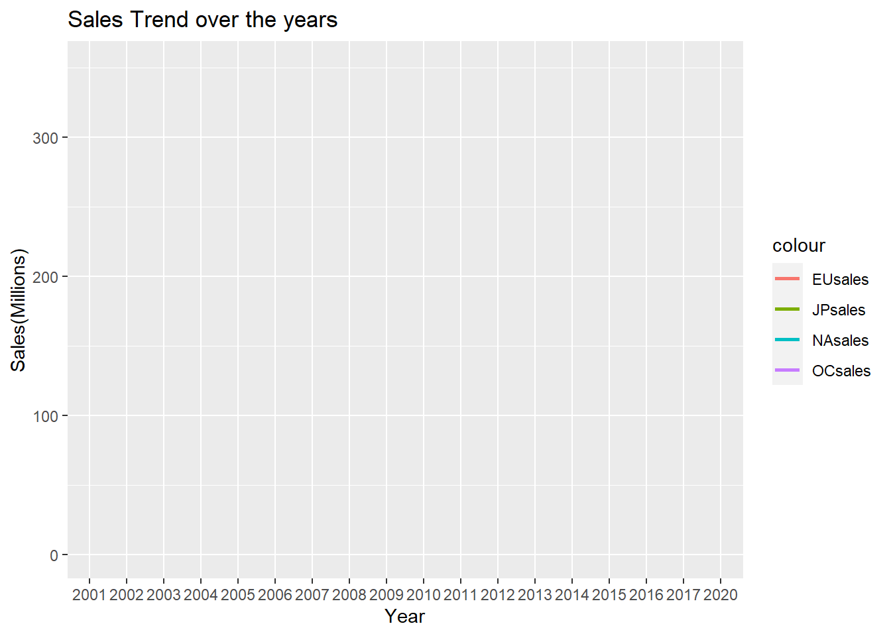
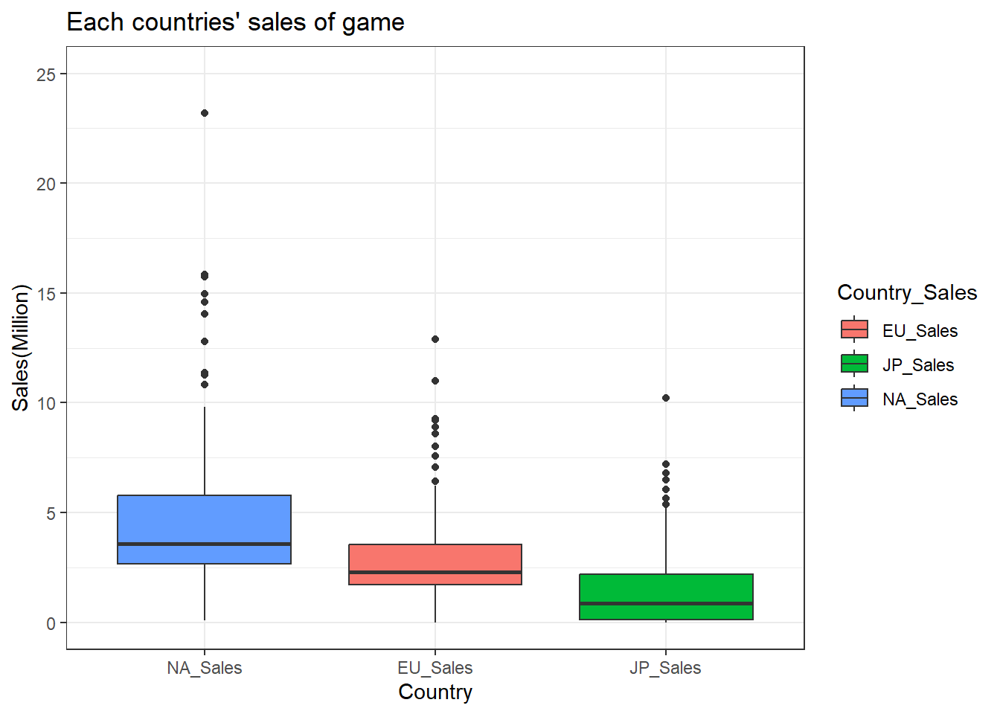
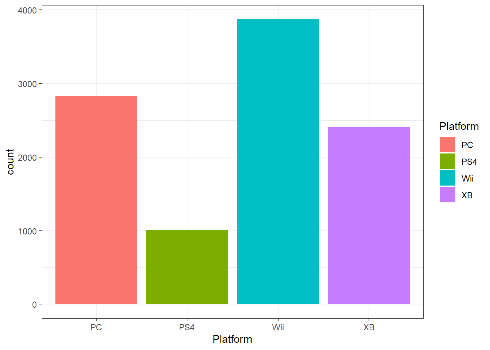
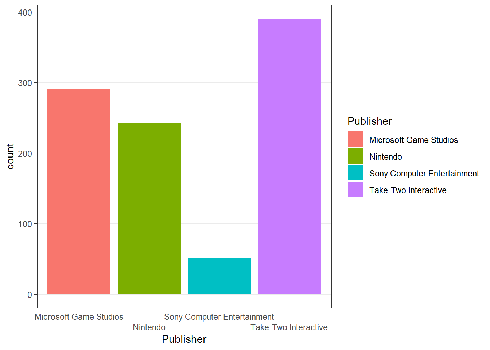
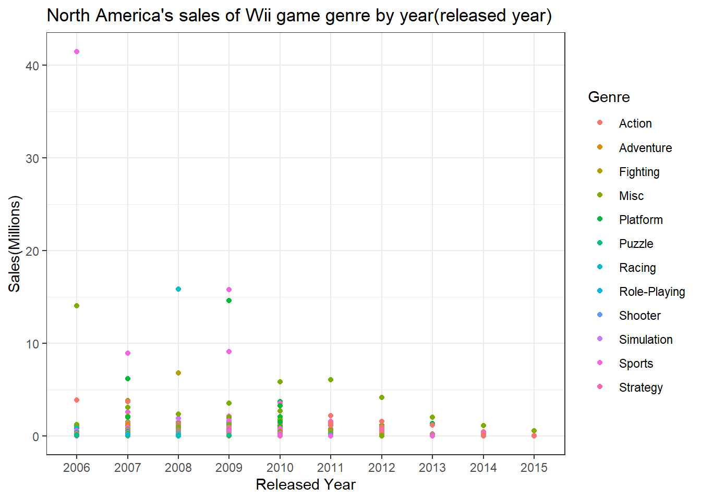
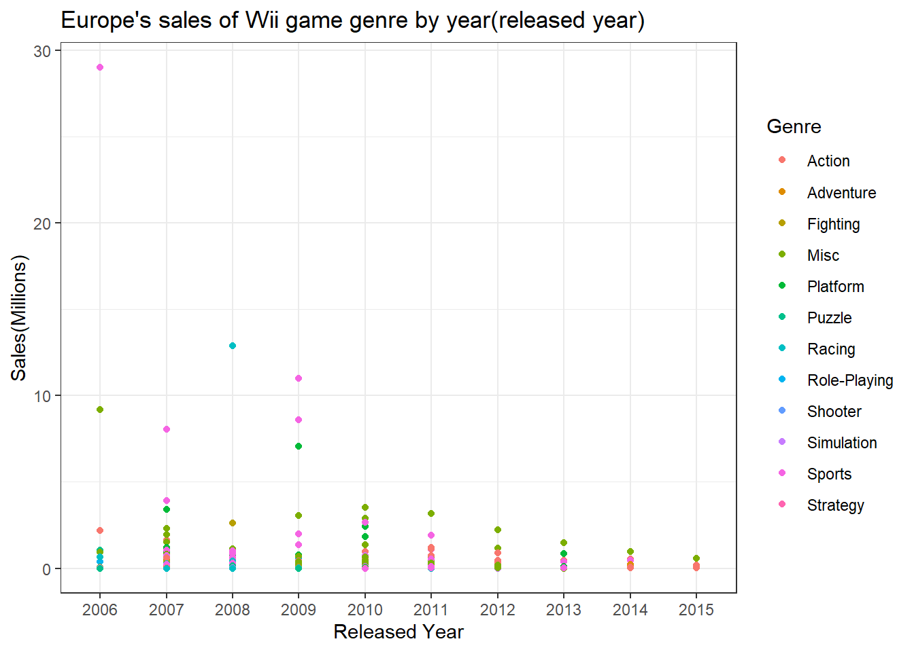
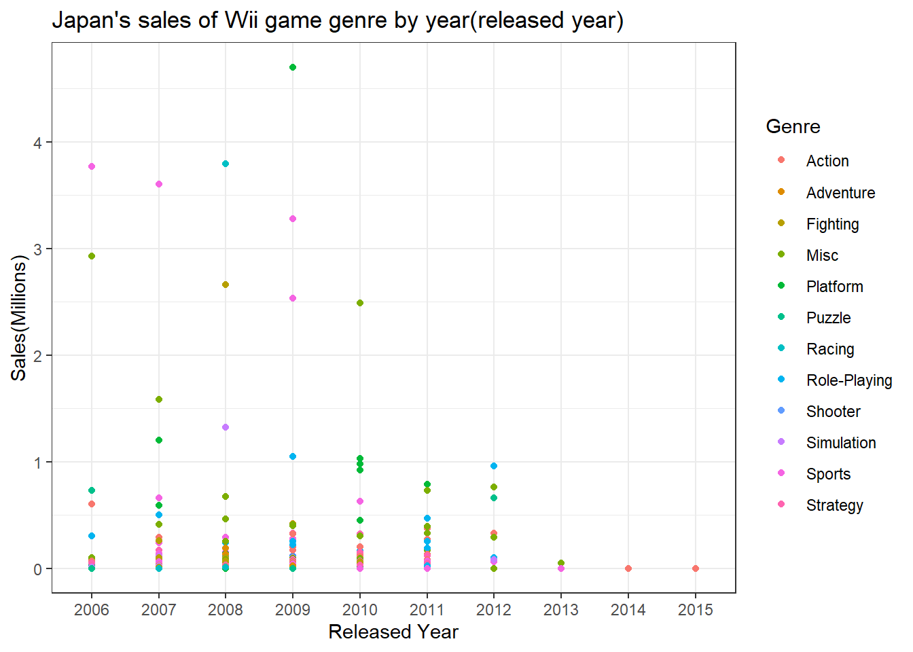
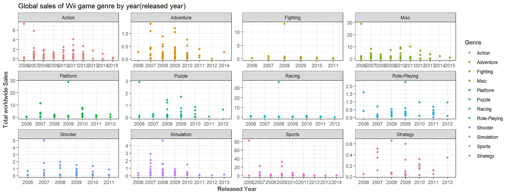
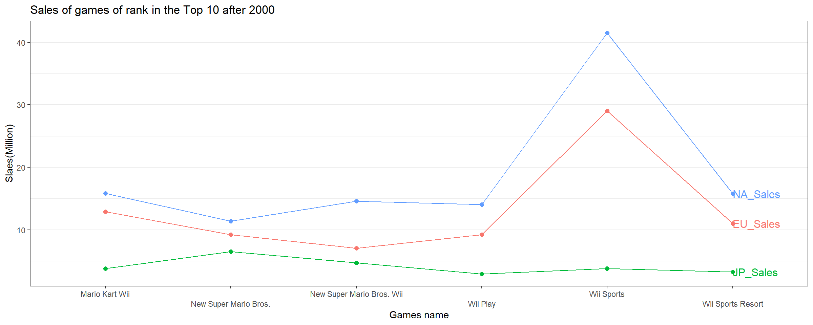

::: {.cell}

```{.r .cell-code}
knitr::opts_chunk$set(echo = TRUE, message = FALSE, warning = FALSE, error = TRUE)
```
:::


## Background

In this 21st century, game has become one of the biggest entertainments in the world. Also, it is one of the way that people can earn money through E-sports as a game player and streaming a game as a game streamer. There are many games brands that people can choose what to play in their taste. As the game industries are growing bigger and being competitive, more various kinds of games are published from many different game companies such as 'Nintendo', 'Play-station', and 'X-Box'.

## Read File


::: {.cell}

```{.r .cell-code}
library(dplyr)
library(pander)
library(ggplot2)
library(tidyverse)
library(tidyr)
library(dplyr)
library(directlabels)
library(ggrepel)
library(mosaic)
library(DT)
```
:::

::: {.cell}

```{.r .cell-code}
game_s <- rio::import("vgsales.csv")
```
:::


## Trend


::: {.cell}

```{.r .cell-code}
game_t <- game_s2 %>%
  filter(Year > 2000) %>%
  filter(Year != "N/A")
```

::: {.cell-output .cell-output-error}
```
Error in filter(., Year > 2000): object 'game_s2' not found
```
:::
:::

::: {.cell}

```{.r .cell-code}
#write.csv(game_t, file = "game_sales.csv")
```
:::

::: {.cell}

```{.r .cell-code}
game_s2 <- game_s %>%
    filter(Year != "N/A") %>%
filter(Year > 2000) %>%
   subset(select = c(Year, NA_Sales, EU_Sales, JP_Sales, Other_Sales, Global_Sales)) %>%
group_by (Year) %>%
  summarize(NAsales = sum(NA_Sales),EUsales = sum(EU_Sales),JPsales = sum(JP_Sales),OCsales = sum(Other_Sales),Global = sum(Global_Sales)) 

ggplot(data = game_s2) + 
geom_line(aes(x = Year, y = NAsales, colour = "NAsales"), size = 1) + 
  geom_line(aes(x = Year, y = EUsales, colour = "EUsales"), size = 1) + 
  geom_line(aes(x = Year, y = JPsales, colour = "JPsales"), size = 1) + 
  geom_line(aes(x = Year, y = OCsales, colour = "OCsales"), size = 1) + 
  labs(title = "Sales Trend over the years", y = "Sales(Millions)")
```

::: {.cell-output-display}
{width=672}
:::
:::


## Compare each countries by Sales

This box-plot shows which country between North America, Europe, and Japan has the most interest in game industry. North America has the highest median and wide range that explains to us how much the game industry is huge up there comparing to other two countries.


::: {.cell}

```{.r .cell-code}
game_s4 <- game_s %>%
  pivot_longer(cols = "NA_Sales":"Global_Sales", names_to = "Country_Sales", values_to = "Sales") %>%
  group_by(Country_Sales) %>%
  filter(Year != "N/A") %>%
  filter(Country_Sales %in% c("NA_Sales", "EU_Sales", "JP_Sales")) %>%
  #filter(Platform %in% c("Wii", "PS4", "PC", "XB")) %>%
  #filter(Year > 2004) %>%
  filter(Rank < 199)
```
:::

::: {.cell}

```{.r .cell-code}
ggplot(data = game_s4) +
  geom_boxplot()+
  aes(x = fct_reorder(Country_Sales, Sales, na.rm = TRUE, .desc = TRUE)) +
  aes(y = Sales) +
  aes(fill = Country_Sales)+
  labs(title = "Each countries' sales of game", x = "Country", y = "Sales(Million)")+
  coord_cartesian(ylim = c(0, 25))+
  theme_bw()
```

::: {.cell-output-display}
{width=672}
:::
:::


## Platform

This histogram shows which platform do people prefer to use when they play games. The Wii is the most famous platform people like to play. On the contrary, PS4 has the least preference to have it. You can tell from this graph Wii platform is having many consumers and occupying big proportion in game industry.


::: {.cell}

```{.r .cell-code}
game_s <- game_s %>%
  filter(Year != "N/A")
```
:::

::: {.cell}

```{.r .cell-code}
game_s2 <- game_s %>%
  pivot_longer(cols = "NA_Sales":"Global_Sales", names_to = "Country_Sales", values_to = "Sales")

game_s2_1 <- game_s2 %>%
  group_by(Country_Sales) %>%
  filter(Year != "N/A") %>%
  filter(Country_Sales %in% c("NA_Sales", "EU_Sales", "JP_Sales")) %>%
  filter(Platform %in% c("Wii", "PS4", "PC", "XB"))
  #filter(Year > 2000)
  #filter(Rank < 499)
```
:::

::: {.cell}

```{.r .cell-code}
ggplot(data = game_s2_1,
       aes(x = Platform, fill=Platform)) +
  geom_histogram(alpha=1, position="identity", stat="count")+
  #coord_cartesian(ylim = c(0, 200))+
  theme_bw()
```

::: {.cell-output-display}
{width=672}
:::
:::


## Publisher

The Take-Two Interactive Publisher has many games that are released.


::: {.cell}

```{.r .cell-code}
game_s2_2 <- game_s2 %>%
  group_by(Country_Sales) %>%
  filter(Year != "N/A") %>%
  filter(Country_Sales %in% c("NA_Sales", "EU_Sales", "JP_Sales")) %>%
  filter(Platform %in% c("Wii", "PS4", "PC", "XB")) %>%
  filter(Publisher %in% c("Nintendo", "Microsoft Game Studios", "Take-Two Interactive", "Sony Computer Entertainment"))
  #filter(Year > 2000)
  #filter(Rank < 499)
```
:::

::: {.cell}

```{.r .cell-code}
ggplot(data = game_s2_2,
       aes(x = Publisher, fill= Publisher)) +
  geom_histogram(alpha=1, position="identity", stat="count")+
  #coord_cartesian(ylim = c(0, 200))+
  theme_bw()+
  scale_x_discrete(guide = guide_axis(n.dodge = 2))
```

::: {.cell-output-display}
{width=672}
:::
:::


## Wii sales of each game genres by year

This charts are showing sales of 'Wii' games in different genres between Europe, North America, Japan, and globally. As Wii games' are popular platform that makes me wonder how many people in the world are having interest in and which games they like to play.


::: {.cell}

```{.r .cell-code}
game_s3 <- game_s2 %>%
  filter(Platform == "Wii" & Year > 2000) %>%
  filter(Year != "N/A")
```
:::


## North America's sales

During 2006, in North America, when sports game genre were released, it has about 41 million sales which has the most sales in total decades.


::: {.cell}

```{.r .cell-code}
game_s3_1 <-  game_s3 %>%
  filter(Country_Sales == "NA_Sales")
```
:::

::: {.cell}

```{.r .cell-code}
ggplot(data = game_s3_1) +
  geom_point(mapping = aes(x = Year, y = Sales, color = Genre))+
  theme_bw()+
  labs(title = "North America's sales of Wii game genre by year(released year)", y = "Sales(Millions)", x = "Released Year")
```

::: {.cell-output-display}
{width=672}
:::

```{.r .cell-code}
  #scale_y_continuous(trans = "sqrt")+
  #facet_wrap("Genre",nrow = 1)
```
:::


## Europe's sales

In Europe as well, it is showing same result that sports game genre in 2006 has the most sales, but low sales than North America. It is about 29 millions.


::: {.cell}

```{.r .cell-code}
game_s3_2 <-  game_s3 %>%
  filter(Country_Sales == "EU_Sales")
```
:::

::: {.cell}

```{.r .cell-code}
ggplot(data = game_s3_2) +
  geom_point(mapping = aes(x = Year, y = Sales, color = Genre))+
  theme_bw()+
  labs(title = "Europe's sales of Wii game genre by year(released year)", y = "Sales(Millions)", x = "Released Year")
```

::: {.cell-output-display}
{width=672}
:::
:::


## Japan's sales

In Japan, it shows spread of sales. Sports game genres were most popular during 2006 and 2007. However, in 2008, the most sales of genre game has changed to role-playing. The highest sales was platform genre games in 2009.


::: {.cell}

```{.r .cell-code}
game_s3_3 <-  game_s3 %>%
  filter(Country_Sales == "JP_Sales")
```
:::

::: {.cell}

```{.r .cell-code}
ggplot(data = game_s3_3) +
  geom_point(mapping = aes(x = Year, y = Sales, color = Genre))+
  theme_bw()+
  labs(title = "Japan's sales of Wii game genre by year(released year)", y = "Sales(Millions)", x = "Released Year")
```

::: {.cell-output-display}
{width=672}
:::
:::


## Global sales

This graph shows the sales all over the world. As you can see many people in the world played Wii sports genre game during 2006 when it has released.


::: {.cell}

```{.r .cell-code}
game_s3_4 <-  game_s3 %>%
  filter(Country_Sales == "Global_Sales")
```
:::

::: {.cell}

```{.r .cell-code}
ggplot(data = game_s3_4) +
  geom_point(mapping = aes(x = Year, y = Sales, color = Genre))+
  facet_wrap("Genre", nrow = 3, scales = "free")+
  theme_bw()+
  labs(title = "Global sales of Wii game genre by year(released year)", y= "Total worldwide Sales", x = "Released Year")
```

::: {.cell-output-display}
{width=1248}
:::
:::


## Sales by Game

The most highest sales about 41 million of game of rank in the Top 10 in overall sales after 2000 was Wii Sports from Nintendo company. As you can see most games in the top rank are from Wii platform and Nintendo Publisher. We can tell that Wii and Nintendo games are being loved from many people.


::: {.cell}

```{.r .cell-code}
game_s5 <- game_s %>%
  pivot_longer(cols = "NA_Sales":"Global_Sales", names_to = "Country_Sales", values_to = "Sales") %>%
  select(Rank, Name, Year, Country_Sales, Sales, Platform, Publisher) %>%
  group_by(Country_Sales) %>%
  filter(Year != "N/A") %>%
  filter(Country_Sales %in% c("NA_Sales", "EU_Sales", "JP_Sales")) %>%
  #filter(Platform %in% c("Wii", "PS4", "PC", "XB")) %>%
  filter(Year > 2000) %>%
  filter(Rank < 10)
```
:::

::: {.cell}

```{.r .cell-code}
ggplot(data = game_s5, mapping = aes(x = Name, y = Sales, color = Country_Sales))+
  geom_line(show.legend = FALSE, aes(group = Country_Sales))+
  geom_point(size = 2,show.legend = FALSE)+
  theme_bw()+
  geom_dl(aes(label = Country_Sales), method = list(dl.combine("last.points")), cex = 0.8, vjust = 5)+
  #geom_vline(aes(xintercept = Name),data = ~ filter(.x, as.numeric(Year) %% 1 == 0))+
  scale_x_discrete(guide = guide_axis(n.dodge = 2))+
  theme(legend.position="none")+
  theme(panel.grid.major.x  = element_blank())+
  labs(title = "Sales of games of rank in the Top 10 after 2000", 
       x = "Games name", y = "Slaes(Million)")
```

::: {.cell-output-display}
{width=1200}
:::
:::


Therefore, we can know that many people in the world has huge interest in playing games. The more people spend on games , gaming industry will grow faster.
